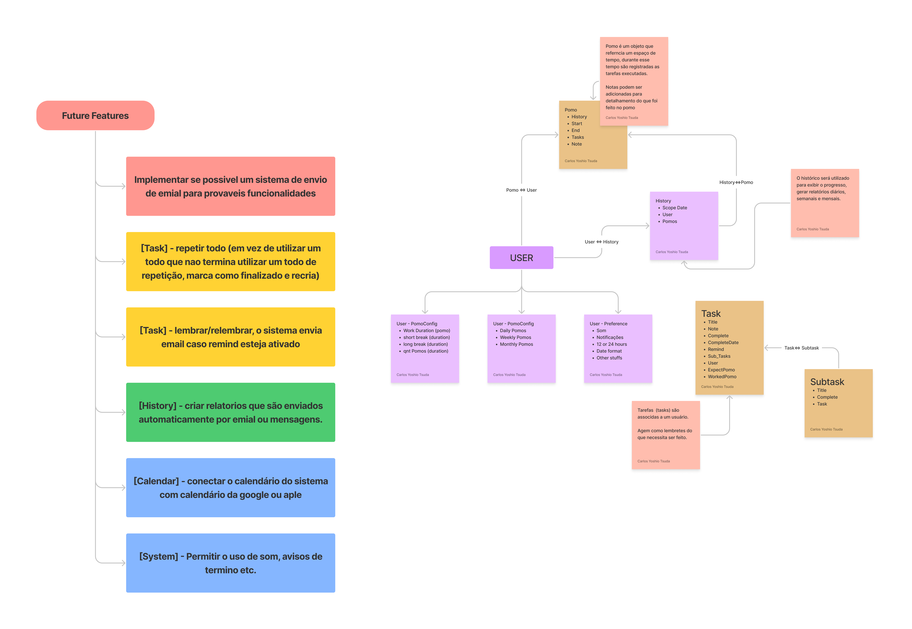

# Pomo App

## Overview

In this project my object is create a pomodoro aplication.
Using strapi as back-end cms and this project as front-end aplication

The system

## System functionalities

### User configuration/preference

App needs to load user preference and change behavior;

- [ ] - System Preference: sounds, types of notifications, date and time format and possible other stuffs
- [ ] - Pomo preference: pomo duration, short break duration, long break duration, the quantity of pomos needs to be completed before the start of the long break.
- [ ] - Goal (Objectives) preference: daily pomos,weekly pomos and monthly pomos
- [ ] - History
- [ ] - List of Todos

### Possible objects

Create a `task object` that will represent the tasks create by users.

Task Object need to have:

- ✔️ Title: a very short text to describe what the task is about;
- ✔️ Note: a text to add information, details or notes about the task;
- ✔️ Expected number of pomodoros: an integer value representing how many pomodoros work cycles it will take to finish the task;
- ✔️ Finish: a boolean value representing whether the task completed or not;
- ✔️ Finish Date: the date when the task was completed;
- ✔️ Remind: date to remind about task;
- [ ] - Sublist: an array of subtaks;
  - ✔️ Title: very short text
  - ✔️ Complete: a flag to show if the subtask is complete
  - ✔️ Reference: a relationship with parent task

History is an array of pomodoros, that includes tasks, dates and others related informations.

- Pomodoro:
  - ✔️ Start Date: when pomodoro start;
  - ✔️ End Date: when pomodoro ends;
  - ✔️ Tasks: Worked task list;
- Date: Date of the first pomodoro

# Planning

## References:

- https://docs.strapi.io/developer-docs/latest/development/backend-customization/controllers.html#adding-a-new-controller

- https://docs.strapi.io/developer-docs/latest/development/backend-customization/controllers.html#extending-core-controllers

## Need to be done
